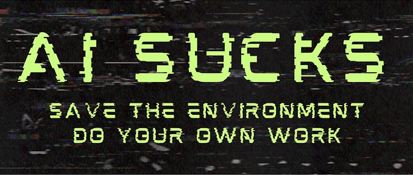

    

<!-- PROJECT SHIELDS -->
[![Contributors][contributors-shield]][contributors-url]
[![Forks][forks-shield]][forks-url]
[![Stargazers][stars-shield]][stars-url]
[![Issues][issues-shield]][issues-url]
[![GNU License][license-shield]][license-url]

<!-- PROJECT LOGO -->
 

  

  <h3 align="center">Prompt attack injection tool for fun with replicants</h3>
  <h3 align="center">THIS PROJECT IS CURRENTLY UNDER CONSTRUCTION!</h3>
  
  

    A quick attack injection tool for playing with replicants. The prompts are located in the "voight-kampff" directory;
you can add your own prompts there, respecting the yaml file format.
     
    <a href="https://github.com/AntoineMeheut/blogame/issues">Report Bug</a>
    ·
    <a href="https://github.com/AntoineMeheut/blogame/projects">Request Feature</a>
  

<!-- TABLE OF CONTENTS -->
# Table of Contents

* [About the Project](#about-the-project)
	* [My goals](#my-goals)
	* [Features](#features)
	* [Prerequisites](#prerequisites)
* TODO
* [Roadmap](#roadmap)
* [Contributing](#contributing)
* [License](#license)
* [Contact](#contact)
* [Acknowledgements](#acknowledgements)

<!-- ABOUT THE PROJECT -->
# About this project
## My goals
TODO

## Features
TODO

## Prerequisites
TODO

<!-- CONTRIBUTING -->
## Contributing

Contributions are what make the open source community such an amazing place to be learn, inspire, and create.
Any contributions you make are **greatly appreciated**.

1. Fork the Project
2. Create your Feature Branch (`git checkout -b feature/AmazingFeature`)
3. Commit your Changes (`git commit -m 'Add some AmazingFeature'`)
4. Push to the Branch (`git push origin feature/AmazingFeature`)
5. Open a Pull Request

<!-- LICENSE -->
## License

Distributed under the MIT License. See `LICENSE` for more information.

<!-- CONTACT -->
## Contact

If you want to contact me [just clic](mailto:github.contacts@protonmail.com)

Project Link: [https://github.com/AntoineMeheut/Deckard](https://github.com/AntoineMeheut/Deckard)

<!-- MARKDOWN LINKS & IMAGES -->
<!-- https://www.markdownguide.org/basic-syntax/#reference-style-links -->
[contributors-shield]: https://img.shields.io/github/contributors/AntoineMeheut/Deckard?color=green
[contributors-url]: https://github.com/AntoineMeheut/Deckard/graphs/contributors
[forks-shield]: https://img.shields.io/github/forks/AntoineMeheut/Deckard
[forks-url]: https://github.com/AntoineMeheut/Deckard/network/members
[stars-shield]: https://img.shields.io/github/stars/AntoineMeheut/Deckard
[stars-url]: https://github.com/AntoineMeheut/Deckard/stargazers
[issues-shield]: https://img.shields.io/github/issues/AntoineMeheut/Deckard
[issues-url]: https://github.com/AntoineMeheut/Deckard/issues
[license-shield]: https://img.shields.io/github/license/AntoineMeheut/Deckard
[license-url]: https://github.com/AntoineMeheut/Deckard/blob/master/LICENSE

